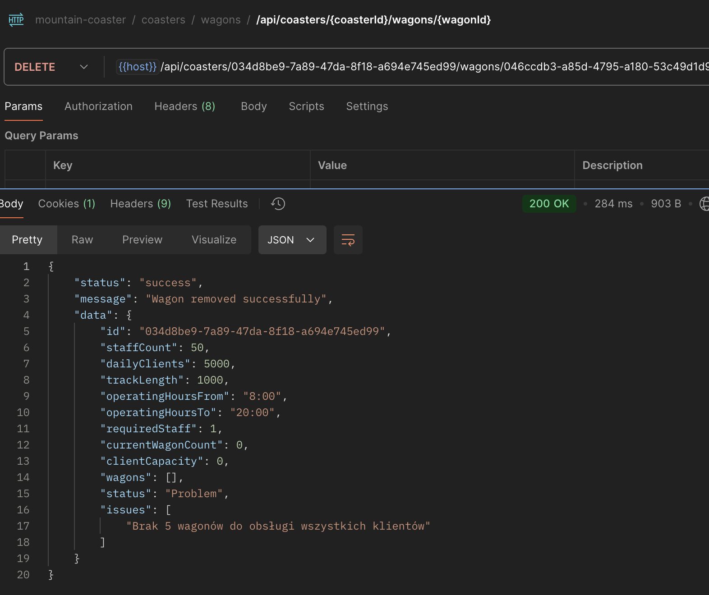
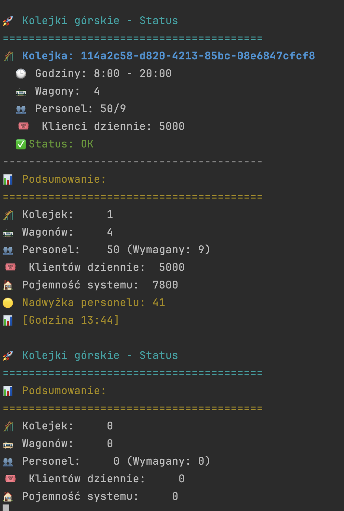

# Mountain Roller Coaster System 🎢

## Overview

This application is an API-based system for managing mountain roller coasters, their wagons, and monitoring system capacity. Built using CodeIgniter 4, this system runs in both development and production environments and uses Redis for data storage.

## Architecture

The project follows clean architecture principles, implementing several design patterns:

- **Domain-Driven Design (DDD)** - Focusing on the core domain models and business logic
- **Command Query Responsibility Segregation (CQRS)** - Separating read and write operations
- **Repository Pattern** - For data access abstraction
- **Dependency Injection** - For loose coupling and testability
- **Event-Driven Architecture** - For system notifications and monitoring
- **Value Objects** - For encapsulating domain concepts

## System Features

- Management of roller coasters with operating hours, staff, and capacity metrics
- Management of wagons with seat capacity and speed attributes 
- Staff requirement calculations and shortage alerts
- Client capacity analysis and wagon requirement calculations
- Real-time monitoring through an asynchronous CLI service
- Separate development and production environments

## Installation

### Requirements

- PHP 8.0 or higher
- Docker and Docker Compose
- Composer

### Setup

1. Clone the repository:

```bash
git clone https://github.com/Przemekhasz/mountain-coaster-system.git
cd mountain-coaster-system
```

2. Install dependencies:

```bash
composer install
```

3. Set up environment:

```bash
cp env .env
```

4. Start the development environment:

```bash
cd docker/dev
docker-compose up -d
```

5. For production:

```bash
cd docker/prod
docker-compose up -d
```

## API Endpoints

### Roller Coasters

- **POST /api/coasters** - Register a new roller coaster
  ```json
  {
    "liczba_personelu": 16,
    "liczba_klientow": 60000,
    "dl_trasy": 1800,
    "godziny_od": "8:00",
    "godziny_do": "16:00"
  }
  ```

- **PUT /api/coasters/:coasterId** - Update an existing roller coaster
  ```json
  {
    "liczba_personelu": 20,
    "liczba_klientow": 70000,
    "godziny_od": "9:00",
    "godziny_do": "17:00"
  }
  ```

- **GET /api/coasters/:coasterId** - Get details of a roller coaster

- **GET /api/statistics** - Get system-wide statistics

### Wagons

- **POST /api/coasters/:coasterId/wagons** - Add a new wagon to a roller coaster
  ```json
  {
    "ilosc_miejsc": 32,
    "predkosc_wagonu": 1.2
  }
  ```

- **DELETE /api/coasters/:coasterId/wagons/:wagonId** - Remove a wagon from a roller coaster

## Monitoring Service

The system includes a real-time asynchronous monitoring service that displays the status of all roller coasters and identifies potential issues.

To start the monitoring service:

```bash
php spark monitor
```

### Screenshots

Here are some screenshots demonstrating the system in action:

#### API Operations


*API Response when creating a new roller coaster with specified parameters*


*Adding new wagons to increase the capacity of a roller coaster*


*Deleting a wagon from the system when it's no longer needed*


*Retrieving detailed information about a specific roller coaster*


*Modifying an existing roller coaster's operating parameters*


*Overview of system-wide statistics showing all coasters and resources*


*Log entries showing detected problems and system notifications*

#### CLI Monitoring Tool

The following screenshots show the CLI monitoring tool in action with real-time updates and status information:


*Real-time monitoring console showing coaster status and statistics*


*Monitoring display with detailed capacity and staffing metrics*


*CLI monitoring showing detected issues and resource allocation*


*Status overview with multiple coasters and their operating parameters*


*System performance metrics and capacity analysis in the monitoring console*
Example console output:

## Technical Design

### Domain Layer

The domain layer contains the core business logic and entities:

- **Entities**: Coaster, Wagon
- **Value Objects**: OperatingHours, Speed
- **Domain Events**: CoasterRegistered, WagonAdded, StaffShortage, ClientCapacityIssue

### Application Layer

The application layer orchestrates the use cases:

- **Commands**: RegisterCoaster, RegisterWagon, RemoveWagon, UpdateCoaster
- **Queries**: GetCoasterDetails, GetSystemStatistics
- **DTOs**: CoasterDTO, WagonDTO

### Infrastructure Layer

The infrastructure layer handles technical concerns:

- **Repositories**: RedisCoasterRepository, RedisWagonRepository
- **Services**: EventDispatcher, LoggingService, IdGenerator
- **CLI**: MonitoringService

### Configuration

- Separate Docker environments for development and production
- Redis configuration for data persistence
- Environment-specific logging levels

## Development vs. Production Environments

### Development Environment

- All log levels are recorded
- Runs on port 8080
- Data is isolated from production
- Meant for testing and development

### Production Environment

- Only warning and error logs are recorded
- Runs on port 80
- Optimized for performance
- Isolated data store

## Best Practices Implemented

- **SOLID Principles**
  - Single Responsibility Principle - Each class has one job
  - Open/Closed Principle - Entities are extendable without modification
  - Liskov Substitution Principle - Repositories use interfaces
  - Interface Segregation - Specific interfaces for specific clients
  - Dependency Inversion - High-level modules don't depend on low-level modules

- **Clean Code**
  - Meaningful variable and method names
  - Small, focused methods
  - Proper exception handling
  - Input validation
  - Comprehensive comments

- **Error Handling**
  - Domain-specific exceptions
  - Graceful error responses
  - Comprehensive logging

- **Testability**
  - Dependency injection
  - Mockable interfaces
  - Unit test structure

## License

This project is licensed under the MIT License - see the LICENSE file for details.
